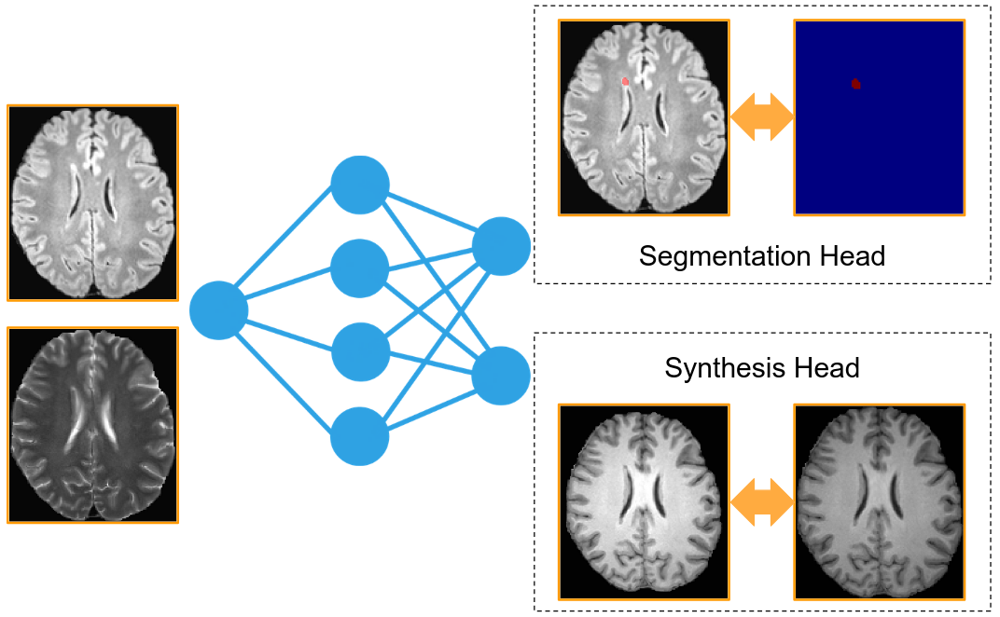

# SynthSegNet

This is the code repository accompanying our paper **"SynthSegNet: Jointly Learning Image Segmentation and Synthesis Improves Lesion Detection and Unlocks the Value of Unlabelled Data"**


Precisely identifying and segmenting lesions represents a critical challenge in medical image analysis. While supervised learning remains the gold standard, it relies heavily on manually labeled data, which is labor-intensive and often limited in availability.

To allow to use also unlabelled data for training a segmentation model, we propose an innovative dual-headed 3D U-Net architecture featuring two output heads: one for lesion segmentation and another for synthetic MRI sequence generation. By sharing weights and employing a coupled loss function, the model leverages supervision from both labeled and unlabeled images through the auxiliary image synthesis task.

## Usage
In order to run our code (```train_synthsegnet.py```), it is essential that you adapt the data dictionary used to load data. A detailed example is also found in ```train_synthsegnet.py```. In essence:

We require a list of dicts of configuration ```{"Input_Images": [/path/to/1stinput.nii.gz, /path/to/2ndinput.nii.gz], "GT_Mask": /path/to/mask.nii.gz OR None, "Target_Image": /path/to/target.nii.gz}```

Please note that we expect all files to be fully pre-processed, i.e., co-registered and skullstripped.
The configuration of each dict in this list is as follows:
```
Input_Images: List of input images to load (and stack)
GT_Mask: Either a path to the GT mask (if it exists) or None
Target_Image: Path to the target image (to be synthesized)
```

## Citation
```Coming soon```
